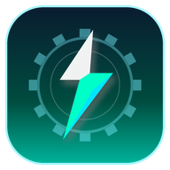

# ⚡ Shortcut Tools for Android

<p align="center">
  
</p>

<p align="center">
  <b>Akses instan sekali ketuk ke pengaturan tersembunyi Android tanpa ribet.</b>
</p>

<p align="center">
  <a href="https://github.com/Mengggzz/Shortcut-Tools/releases"></a>
  <a href="https://flutter.dev"></a>
  <a href="https://developer.android.com"></a>
  <a href="https://github.com/Mengggzz/Shortcut-Tools/actions"></a>
</p>

---

## 📌 Ringkasan

Banyak pengaturan penting Android (seperti **Private DNS**, **Akses Notifikasi**, **Info Aplikasi**, hingga **Opsi Pengembang**) terkubur 3–5 tingkat di dalam menu Pengaturan sistem. Setiap vendor perangkat (Samsung One UI, Xiaomi HyperOS/MIUI, Pixel, Oppo ColorOS, dll.) juga menata menu secara berbeda-beda.

**Shortcut Tools** memecahkan masalah ini dengan menyediakan katalog pintasan langsung (*one-tap shortcut*) berbasis Android Intent dengan sistem rantai fallback cerdas.

> **Zero Overhead & Zero Permissions**: Aplikasi ini 100% aman — tidak membutuhkan izin berbahaya (*dangerous permissions*), tidak menjalankan *background service* yang menguras baterai, dan berukuran sangat ringan (< 15 MB).

---

## ✨ Fitur Utama

### 1. 🎯 Katalog Pintasan Lengkap (19+ Built-in)
Terbagi rapi dalam 4 kategori utama:
- 🌐 **Jaringan & Internet**: WiFi, Private DNS (DoT), Penggunaan Data, Bluetooth, NFC, VPN.
- 📱 **Perangkat**: Pengaturan Layar, Suara & Getaran, Penghemat Baterai, Manajemen Penyimpanan.
- 📦 **Aplikasi**: Semua Aplikasi, Info Aplikasi Ini (`package:self`), Akses Notifikasi, Cast Layar.
- ⚙️ **Sistem**: Layanan Lokasi (GPS), Tanggal & Waktu, Bahasa & Input, Tentang Ponsel, Layanan Pencetakan.

### 2. 🛡️ Rantai Fallback Intent Anti-Crash
Setiap pintasan dilengkapi daftar aksi alternatif (*fallbacks*) jika OEM tertentu memodifikasi atau menghapus intent standar Android. Jika sebuah halaman tidak ditemukan, sistem otomatis beralih ke fallback terdekat dan berakhir di Pengaturan utama secara elegan tanpa pernah *force close*.

### 3. 🚀 Akses Cepat Native Android
- **Quick Settings Tile (Android 7+)**: Buka pintasan favorit langsung dari panel notifikasi atas notification shade dalam 1 tap (`TileService`).
- **Pin ke Home Screen (Android 8+)**: Buat shortcut icon mandiri di launcher perangkat (`ShortcutManager`).
- **Home Screen Widget (2×2)**: Pasang widget berisikan hingga 4 tombol pintasan favorit. Tombol widget berjalan secara native dan instan tanpa membebani memori Flutter engine.

### 4. 🔍 Pencarian Pintar & Keyword Alias
Cari pengaturan bukan hanya dari judul, tapi juga menggunakan istilah umum sehari-hari:
- Ketik `"adblock"` atau `"iklan"` ➔ muncul **Private DNS**
- Ketik `"kuota"` atau `"paket"` ➔ muncul **Penggunaan Data**
- Ketik `"tws"` atau `"earphone"` ➔ muncul **Bluetooth**

### 5. ⭐ Favorit & Riwayat Otomatis
- **Terakhir Dibuka**: Secara otomatis mencatat hingga 8 pintasan terakhir yang sering Anda buka.
- **Favorit**: Sematkan pintasan prioritas di bagian paling atas dengan menekan lama (*long-press*) kartu pintasan.

### 6. 🎨 Material 3 & Tema Dinamis
Dukungan penuh antarmuka modern Material You dengan switch tema instan:
- ☀️ **Mode Terang**
- 🌙 **Mode Gelap**
- ⚙️ **Ikuti Sistem**

---

## 🏗️ Arsitektur Proyek

```
Shortcut-Tools/
├── .github/workflows/
│   └── release.yml             # CI/CD otomatis: build APK & publish release
├── android/
│   └── app/src/main/
│       ├── kotlin/com/example/shortcut_tools/
│       │   ├── MainActivity.kt            # MethodChannel handler & Pin Shortcut
│       │   ├── ShortcutTileService.kt     # Native Quick Settings Tile
│       │   ├── ShortcutWidgetProvider.kt  # Native Home Screen 2x2 Widget
│       │   └── WidgetLaunchActivity.kt    # Launcher transparan tanpa Flutter engine
│       └── res/                           # Layout widget, XML provider & resources
├── lib/
│   ├── data/
│   │   └── shortcuts_catalog.dart         # Katalog 19+ entri pintasan & alias
│   ├── models/
│   │   └── tool_shortcut.dart             # Model data kelas ToolShortcut
│   ├── screens/
│   │   └── home_screen.dart               # Antarmuka utama, search, & filter
│   ├── services/
│   │   ├── shortcut_service.dart          # Platform channel bridge
│   │   ├── favorites_service.dart         # Penyimpanan lokal favorit
│   │   ├── recents_service.dart           # Riwayat buka otomatis
│   │   ├── theme_service.dart             # Manajemen tema instan
│   │   └── onboarding_service.dart        # Edukasi gestur pertama kali
│   └── main.dart                          # Inisialisasi aplikasi
├── PRD.md                                 # Product Requirements Document lengkap
├── mockup.html                            # Desain visual interaktif
└── pubspec.yaml
```

---

## 📥 Download & Instalasi

### Pengguna Android
Unduh APK rilis terbaru langsung dari tab **[Releases](https://github.com/Mengggzz/Shortcut-Tools/releases)**:
- **`shortcut-tools-arm64-v8a.apk`** (Direkomendasikan untuk hampir semua smartphone Android modern)
- **`shortcut-tools-armeabi-v7a.apk`** (Untuk perangkat 32-bit lama)
- **`shortcut-tools-x86_64.apk`** (Untuk emulator / Chromebook)

---

## 👨‍💻 Panduan Pengembangan (Developer Guide)

### Prasyarat
- Flutter SDK `>= 3.13.0`
- Android SDK (API Level 34 / Min SDK 24)
- Java 17

### Menjalankan di Lokal
1. **Clone repository**:
   ```bash
   git clone https://github.com/Mengggzz/Shortcut-Tools.git
   cd Shortcut-Tools
   ```

2. **Pasang dependensi**:
   ```bash
   flutter pub get
   ```

3. **Jalankan pengujian & linter**:
   ```bash
   flutter analyze
   flutter test
   ```

4. **Jalankan pada perangkat / emulator**:
   ```bash
   flutter run
   ```

### Build APK Mandiri
```bash
# Build APK per-arsitektur CPU (Ramping & Cepat)
flutter build apk --release --split-per-abi
```
File hasil kompilasi akan berada di folder `build/app/outputs/flutter-apk/`.

---

## ➕ Cara Menambahkan Pintasan Baru

Cukup tambahkan entri baru ke dalam `lib/data/shortcuts_catalog.dart`:

```dart
ToolShortcut(
  id: 'hotspot',
  title: 'Hotspot Portabel',
  description: 'Berbagi koneksi internet via tethering',
  category: 'Jaringan',
  icon: Icons.wifi_tethering,
  action: 'android.settings.TETHER_SETTINGS',
  fallbacks: ['android.settings.WIRELESS_SETTINGS'],
  keywords: ['hotspot', 'tethering', 'wifi sharing', 'bagi kuota'],
),
```

---

## 🔒 Privasi & Keamanan

Aplikasi ini mengusung prinsip **Privacy First**:
- ❌ **Tidak ada pelacakan / analitik**: Nol pengumpulan data pengguna.
- ❌ **Tidak ada koneksi internet / cloud**: Seluruh data riwayat & favorit disimpan secara lokal di perangkat.
- ❌ **Tidak ada izin sensitif**: Tidak meminta izin kontak, penyimpanan eksternal, mikrofon, kamera, maupun lokasi latar belakang.

---

## 📄 Lisensi

Proyek ini dirilis di bawah lisensi open source untuk kemudahan akses dan produktivitas komunitas Android.
